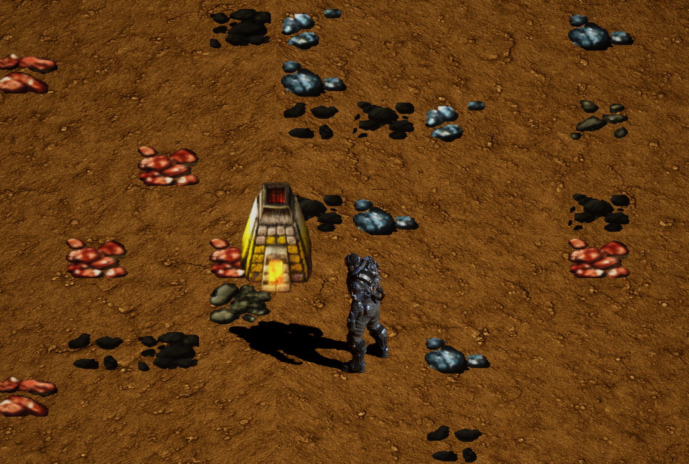
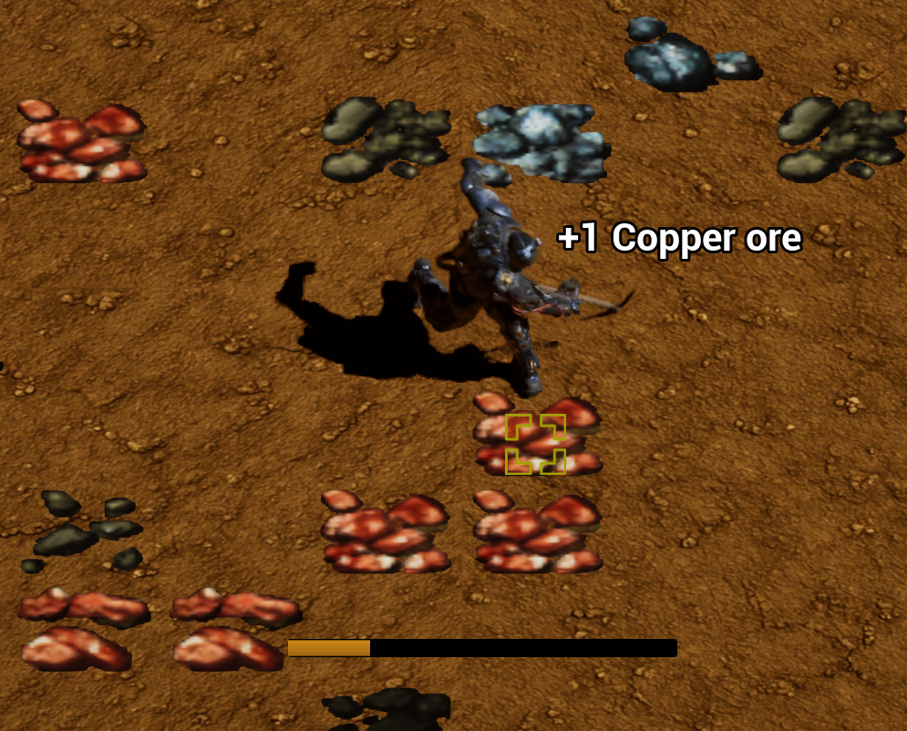

# MBFactorio 팀 프로젝트
## 🎮 프로젝트 개요
| 항목        | 내용                              |
|-------------|-----------------------------------|
| **장르**        | 탑다운 샌드박스 게임                 |
| **컨셉**        | Factorio에서 영감을 받아 제작한 황무지 생존 탐험        |
| **목표**        | C++ 및 Unreal Engine 5.4 기반으로, 자원 채굴과 아이템 제작이 가능한 핵심 게임 시스템 구현 |
| **기간**        | 2025.04.03 ~ 2025.04.17           |
| **참여 인원**      | 3명(전원 개발 참여)                            |

<br></br>

---

## 🛠️ 기술 스택
- **언어** : C++
- **게임 엔진** : Unreal Engine 5.4
- **버전 관리** : Sourcetree, GitHub
- **IDE** : Visual Studio 2022

---

## ⚡ 빌드 및 실행 방법

1. **필수 환경**
   - Unreal Engine 5.4
   - Visual Studio 2022	
   - Windows 10/11 64bit

2. **프로젝트 클론**
    ```bash
    git clone https://github.com/WJMcode/MBFactorio.git
    ```

3. **프로젝트 열기**
   - `MBFactorio.uproject` 파일을 더블 클릭하거나, 언리얼 에디터에서 직접 열기

4. **Visual Studio 프로젝트 생성 및 빌드**
   - `MBFactorio.uproject` 파일 우클릭 → `Generate Visual Studio project files`
   - 생성된 `.sln` 파일을 Visual Studio에서 열고 빌드 실행 (`Ctrl + Shift + B`)

5. **게임 실행**
   - 언리얼 에디터에서 `Play` 클릭

---

## ✨ 주요 기능 요약

- **타일 기반 맵 시스템**  
플레이어 중심의 무작위 타일 배치를 통해 지형 및 자원을 생성하는 샌드박스 환경을 구성합니다.

- **채굴 컴포넌트 시스템**  
자원 타일과의 상호작용, 채굴 진행도 UI, 인벤토리 반영까지 연결되는 채굴 시스템을 개발하였습니다.

---

## 💡 설계 포인트
- 데이터 에셋/컴포넌트 기반 구조로 확장성/재사용성 강화
- 랜덤 맵 생성 및 확률적 타일 배치로 플레이 다양성 확보
- 코드 분리 및 예외처리로 UX와 안정성 향상

---

## 🧠 프로젝트 구조

```text
MBFactorio/
├── Source/
│   └── MBFactorio/
│       ├── Components/   # 채굴 등 각종 게임 컴포넌트 (예: MiningComponent)
│       ├── Tiles/        # 타일 관리, 랜덤 배치 등 타일 관련 코드
│       └── ...           # 기타 게임 모듈 및 코드
├── Content/              # 언리얼 에셋
├── README.md
└── ...
```
---

## 👤 기여한 부분

### 1. TileGridManager 시스템
- **타일 클래스 설계**  
	- 공통 기능과 메시를 관리하는 `Tile` 클래스를 설계하고,  
	**Ground, Resource, Structures** 등 다양한 하위 클래스를 구성하였습니다.
- **타일 데이터 구조화**  
	- `TileStructs` 구조체를 통해 **자원은 타입별 다중 머티리얼, 구조물은 단일 머티리얼** 구조로 정의하였습니다.  
	- 이를 기반으로 `TileDataAsset` 클래스를 설계하여, **언리얼 에디터에서 타입 및 머티리얼 데이터를 직관적으로  
 	설정·관리**할 수 있도록 구성하였습니다.
- **타일 랜덤 배치**  
	- `TileGridManager` 클래스에서 플레이어를 중심으로 다양한 타입의 타일을  
 	**확률에 따라 배치하고, 각 타일에 랜덤한 회전과 머티리얼을 적용**하였습니다.
- **핵심 함수**  
  - `SpawnTiles` 함수 하나로 다양한 타일의 생성을 통합하였습니다.  

### 2. MiningComponent 시스템
- **채굴 시스템 설계**
  	- 플레이어가 **Resource 타일에 오버랩 후 우클릭**하는 방식으로 채굴할 수 있도록 구현하였습니다.
	- 광물의 종류는 ResourceTile의 타입에 따라 자동 판별되며, **해당 자원이 인벤토리에 추가**됩니다.
- **채굴 진행 시각화**
	- 채굴 진행 중에는 **HUD에 진행도 위젯을 표시**하고,  
	**완료 또는 중단 시, HUD를 숨기며 결과를 인벤토리에 반영**하도록 구성하였습니다.
- **컴포넌트화 구조 설계**
	- `MiningComponent` 클래스를 설계하여 캐릭터에 **독립적으로 부착 가능한 구조**로 제작하였습니다.  
	이를 통해 **재사용성과 유지보수성**을 높였습니다.
- **핵심 함수**  
	- `TryStartMining`, `StartMining`, `StopMining` 등의 함수로  
	**채굴 로직을 모듈화**하여 관리하였습니다.

---
 
## 🔎 세부 구현 (주요 코드/로직)

### 1. 타일 랜덤 배치 및 타입/머티리얼 자동 할당

타일 타입과 머티리얼 정보는 C++ 구조체로 설계되며,  
언리얼 에디터의 Data Asset에서 실제 값들을 관리합니다.

  타일 타입과 머티리얼 등 주요 속성 관리는 아래와 같은 데이터 구조(Struct/Enum)로 정의합니다 :
  ```cpp
  UENUM(BlueprintType)
  enum class EResourceType : uint8
  {
      Copper, Iron, Stone, Coal, Unknown UMETA(Hidden)
  };

  USTRUCT(BlueprintType)
  struct FResourceTypeAndMaterials
  {
      GENERATED_BODY()
      UPROPERTY(EditAnywhere, BlueprintReadWrite)
      EResourceType ResourceType;
      UPROPERTY(EditAnywhere, BlueprintReadWrite)
      TArray<UMaterialInterface*> Materials;
  };
  ```

위 구조를 바탕으로, SpawnTiles 함수는 플레이어 주변에 다양한 종류의 타일을 랜덤 확률로 배치합니다.  
SpawnTiles 함수는 타일의 종류(Ground/Resource/Structures)에 따라 타입, 머티리얼, 크기를 유연하게 할당하는 함수입니다.

> **이 시스템을 통해 매번 다른 땅과 자원이 배치되어
> 새 게임 시작 시, 새로운 재미를 제공합니다.**

  - **Ground 타일 :** 머티리얼만 랜덤 지정
  - **Resource 타일 :** 광물 타입 + 머티리얼 세트 중 하나를 랜덤 선택 후 지정
  - **Structures 타일 :** 미리 지정된 타입/머티리얼/크기로 설정
    <br>
    
  - **대표 로직** :
```cpp
for (int32 X = 0; X < GridWidth; ++X)
  for (int32 Y = 0; Y < GridHeight; ++Y)
    if (생성될 확률 통과)
      NewTile = SpawnActor(...);
      if (GroundTile == NewTile)          { 랜덤 머티리얼 }
      else if (ResourceTile == NewTile)   { 타입+머티리얼 세트 랜덤 적용 }
      else if (StructuresTile == NewTile) { 지정값 적용 }
      else                                { 잘못된 타일 클래스 }
```
  - **상세 코드** :
      <details>
        <summary> TileGridManager 클래스의 SpawnTiles 함수 코드 </summary>
	      
       ```cpp
       /* @param TileClass		생성할 타일 명시 (땅, 광물, 구조물 등)
        * @param SpawnProbability   	타일이 생성될 확률 (0.0 ~ 1.0)
        * @param ZOffset		생성 위치의 Z축 보정값(예 : 광물을 땅 위에 살짝 띄우는 용도)
        * @param InTileSize		타일의 크기 설정
        * @param InRotator		타일에 적용할 회전값
        * @param bUseRandomRotation	랜덤 회전값 사용 여부
        */
       void ATileGridManager::SpawnTiles(TSubclassOf<ATile> TileClass, float SpawnProbability, float ZOffset, float InTileSize, FRotator InRotator, bool bUseRandomRotation)
       {
	       // 캐릭터 가져오기
	       ACharacter* PlayerCharacter = UGameplayStatics::GetPlayerCharacter(GetWorld(), 0);
	       if (!PlayerCharacter || !TileClass) 
	       {
		       UE_LOG(LogTemp, Warning, TEXT("타일 생성 실패: 캐릭터 또는 TileClass 없음"));
		       return;
	       }
       
	       // 캐릭터 발바닥 높이 계산
	       float HalfHeight = PlayerCharacter->GetCapsuleComponent()->GetScaledCapsuleHalfHeight();
	       FVector PlayerLocation = PlayerCharacter->GetActorLocation();
	       float FootZValue = PlayerLocation.Z - HalfHeight;

	       // 생성할 타일의 개수
	       int32 GridWidth = TileDataAsset->GridWidth;
	       int32 GridHeight = TileDataAsset->GridHeight;

	       // 구조물 타일인 경우 하나만 생성
	       if(TileClass->IsChildOf(AStructuresTile::StaticClass()))
	       {
		       GridWidth = 1;
		       GridHeight = 1;
	       }

	       // 타일 그리드 중심이 캐릭터 위치로 가도록 보정
	       FVector Origin = PlayerLocation - FVector((GridWidth - 1) * InTileSize * 0.5f, (GridHeight - 1) * InTileSize * 0.5f, 0.f);

	       for (int32 Y = 0; Y < GridHeight; ++Y)
	       {
		       for (int32 X = 0; X < GridWidth; ++X)
		       {
			
			       // 0.0 ~ 1.0 사이의 난수를 뽑아서 확률적으로 타일을 생성
			       // Resource 타일은 부분적으로 생성하기 위함.
			       if (FMath::FRand() > SpawnProbability) continue;

			       FVector Location = Origin + FVector(X * InTileSize, Y * InTileSize, 0.f);
			       Location.Z = FootZValue + ZOffset;	// 발바닥 높이에 생성

			       // bUseRandomRotation가 ture면 랜덤 회전값 적용
			       // false면 인자로 받은 회전값 사용
			       FRotator Rotation = 
										       // 타일을 0, 90, 180, 270도 중 하나로 회전
				       bUseRandomRotation ? FRotator(0.f, FMath::RandRange(0, 3) * 90, 0.f) : InRotator;

			       ATile* NewTile = GetWorld()->SpawnActor<ATile>(TileClass, Location, Rotation);
			       if (NewTile)
			       {
				       // 타일 크기 설정
				       NewTile->SetTileScale(InTileSize);

				       // 땅 타일일 경우 머티리얼만 랜덤으로 설정
				       if (AGroundTile* GroundTile = Cast<AGroundTile>(NewTile))
				       {
					       if (TileDataAsset && TileDataAsset->GroundTileMaterials.Num() > 0)
					       {
						       GroundTile->SetRandomTileMaterial(TileDataAsset->GroundTileMaterials);
					       }
				       }
				       // 리소스 타일일 경우 타입 설정 및 랜덤 머티리얼 설정
				       else if (AResourceTile* ResourceTile = Cast<AResourceTile>(NewTile))
				       {
					       if (TileDataAsset && TileDataAsset->ResourceTileTypeAndMaterialSet.Num() > 0)
					       {
						       const TArray<FResourceTypeAndMaterials>& Sets = TileDataAsset->ResourceTileTypeAndMaterialSet;
						       int32 Index = FMath::RandRange(0, Sets.Num() - 1);
						       // Sets에 있는 여러 개의 타입 중 하나를 뽑아, 
						       // 타입과 머티리얼 정보를 SelectedSet에 저장
						       const FResourceTypeAndMaterials& SelectedSet = Sets[Index];

						       // SelectedSet에 담긴 타입 정보로 생성된 타일 타입을 설정
						       ResourceTile->SetResourceType(SelectedSet.ResourceType);
						       // SelectedSet에 담긴 머티리얼 배열을 통해 생성된 타일의 머티리얼을 설정
						       ResourceTile->SetRandomTileMaterial(SelectedSet.Materials);
					       }
				       }
				       // 구조물 타일일 경우 한 가지의 머티리얼로 세팅
				       else if (AStructuresTile* StructuresTile = Cast<AStructuresTile>(NewTile))
				       {
					       if (TileDataAsset && TileDataAsset->StructuresTypeAndMaterial.Material)
					       {
						       // StructuresTypeAndMaterial에 담긴 타입 정보로 생성된 타일 타입을 설정
						       StructuresTile->SetStructuresType(TileDataAsset->StructuresTypeAndMaterial.StructuresType);
						       // StructuresTypeAndMaterial에 담긴 머티리얼을 통해 생성된 타일의 머티리얼을 설정
						       StructuresTile->SetTileMaterial(TileDataAsset->StructuresTypeAndMaterial.Material);
						       // 구조물 타입에 따라 크기를 조정 (예: 화로는 세로로 2칸 차지)
						       StructuresTile->SetStructuresTileScale(StructuresTile->GetStructuresType(), InTileSize);
					       }
				       }
				       else
				       {
					       UE_LOG(LogTemp, Warning, TEXT("잘못된 타일 클래스입니다."));
				       }
			       }
			       else
			       {
				       UE_LOG(LogTemp, Warning, TEXT("타일 스폰 실패: (%d, %d)"), X, Y);
			       }
		       }
	       }
       }
       ```
      </details>

  - **인게임 적용** :
<br></br>

<br></br>

### 2. MiningComponent의 채굴 시스템

플레이어가 ResourceTile 위에서 우클릭(마우스 Hold)하면 채굴이 진행되며,  
진행도는 HUD에 표시되고, 완료 시 인벤토리에 자원이 추가됩니다.

  - **진행 흐름** : 
  1. 플레이어가 타일과 오버랩 + 우클릭 Hold → `StartMining()` 호출  
  2. 채굴 진행도(HUD) 실시간 반영  
  3. 완료 시 인벤토리 반영, 채굴 자원 텍스트 애니메이션 처리  
  4. 예외(정지, 중단) 처리 등은 별도 함수에서 관리

  - **상세 코드** :
      <details>
        <summary> MiningComponent 클래스의 StartMining 함수 코드 </summary>
	      
       ```cpp
       void UMiningComponent::StartMining()
       {
	       APlayerCharacter* PlayerCharacter = Cast<APlayerCharacter>(GetOwner());
	       if (!PlayerCharacter)
	       {
		       UE_LOG(LogTemp, Error, TEXT("UMiningComponent::StartMining(): Owner가 nullptr입니다 !"));
		       return;
	       }

	       // 플레이어가 채굴 중이 아니라면
	       if (!IsMining())
	       {
		       SetIsMining(true);

		       PlayerCharacter->ShowPickaxe(true);
	       }

	       // 채굴 시작
	       {
		        /* 프로그래스바를 채우기 위해 채굴이 시작되면 HUD에게 Broadcast합니다.
			        프로그래스바는 0.f ~ 1.f의 값을 받아 바를 채웁니다.					*/
		       OnMiningProgress.Broadcast(MiningProgressValue / MiningTimeToComplete);

		       // 채굴 진행바를 채우기 위한 변수의 값을 점점 올림
		       MiningProgressValue += GetWorld()->GetDeltaSeconds();

		       // 채굴 완료
		       if (MiningProgressValue >= MiningTimeToComplete)
		       {
			       MiningProgressValue = 0.f;

			       // 채굴한 광물을 텍스트로 출력하기 위해 HUD에게 Broadcast합니다.
			       OnMiningComplete.Broadcast(CurrentTargetTile->GetResourceType());
			
			       // 인벤토리에 채굴한 아이템 삽입
			       {
				       EResourceType MinedResourceType = CurrentTargetTile->GetResourceType();
				       FName ItemName = NAME_None;
				       switch (MinedResourceType){...}
				       if (ItemName != NAME_None)
				       {
					       PlayerCharacter->GetInventoryComponent()->AddItem(ItemName, 1);
				       }
			       }
		       }
	       }

	       // 채굴 몽타주가 재생되고 있지 않다면, 채굴 몽타주 재생
	       if (!bIsMiningAnimationPlaying)
	       {
		       PlayerCharacter->PlayMiningAnimation();
	       }
       }
       ```
      </details>

  - **인게임 적용** :
<br></br>

<br></br>

---

## 🔍 구현 시 고민 및 문제 해결

- **복수 오버랩 처리** :  
  - 여러 광물 타일과 동시 오버랩 시, 첫 번째 타일만 인식하던 문제
  - → 오버랩 해제 시 `FindOverlappingTile()` 호출, 주변 타일 재탐색 및 상태 동기화

- **UX 개선** :  
  - 채굴 도중 우클릭 미유지/커서 이탈 등 예외처리 강화  
  - 애니메이션 반복 방지 등 사용자 경험 개선

- **구조 리팩토링** :  
  - 컴포넌트 기반 구조 적용으로 코드 재사용성/유지보수성 강화

---

## 📝 참고 사항
- 빌드/실행 오류 발생 시 Content 경로 확인 필수
  
---

### ✉️ Contact

- 이메일 : uoipoip@gmail.com
- GitHub : [WJMcode/MBFactorio](https://github.com/WJMcode/MBFactorio)

---

