# MBFactorio 팀 프로젝트
## 🎮 프로젝트 개요
| 항목        | 내용                              |
|-------------|-----------------------------------|
| **장르**        | 탑다운 뷰의 샌드박스 게임                 |
| **컨셉**        | Factorio에서 영감을 받아 제작한 황무지 생존 탐험        |
| **목표**        | C++ 및 Unreal Engine 5.4 기반으로, 자원 채굴과 아이템 제작이 가능한 핵심 게임 시스템 구현 |
| **기간**        | 2025.04.03 ~ 2025.04.17           |
| **참여 인원**      | 3명(전원 개발 참여)                            |


---

## 🛠️ 기술 스택
- **언어** : C++
- **게임 엔진** : Unreal Engine 5.4
- **버전 관리** : Sourcetree, GitHub
- **IDE** : Visual Studio 2022

---

## ⚡ 빌드 및 실행 방법

1. **필수 환경**
   - Unreal Engine 5.4
   - Visual Studio 2022	
   - Windows 10/11 64bit

2. **프로젝트 클론**
    ```bash
    git clone https://github.com/WJMcode/MBFactorio.git
    ```

3. **프로젝트 열기**
   - `MBFactorio.uproject` 파일을 더블 클릭하거나, 언리얼 에디터에서 직접 열기

4. **Visual Studio 프로젝트 생성 및 빌드**
   - `MBFactorio.uproject` 파일 우클릭 → `Generate Visual Studio project files`
   - 생성된 `.sln` 파일을 Visual Studio에서 열고 빌드 실행 (`Ctrl + Shift + B`)

5. **게임 실행**
   - 언리얼 에디터에서 `Play` 클릭

---

## 📌 주요 기능 요약

- **타일 기반 맵 시스템**  
**플레이어 중심의 무작위 타일 배치**를 통해 지형 및 자원을 생성하는 **샌드박스 환경을 구성**합니다.

- **채굴 컴포넌트**  
Resource 타일과의 상호작용, 채굴 진행도 UI, 인벤토리 반영까지 연결되는 **채굴 흐름을 컴포넌트화**하여 개발하였습니다.

---

## 💡 설계 포인트
- **데이터 에셋 및 컴포넌트 기반 구조 설계**  
  타일 정보는 `TileDataAsset`, 채굴 로직은 `MiningComponent`로 분리하여,  
  **확장성, 재사용성, 유지보수 편의성**을 고려한 구조를 설계하였습니다.

- **확률 기반 랜덤 맵 생성으로 플레이의 다양성과 반복성 강화**  
  플레이어 주변에 **확률적으로 다양한 타일을 배치**해 매 게임마다 다른 맵 환경을 제공합니다.

- **컴포넌트 모듈화 및 예외 처리로 UX 및 안정성 향상**  
  채굴 중 조건 불충족 시 자동 취소 등 예외 처리를 통해 **버그를 방지하고 사용자 경험을 개선**하였습니다.

---

## 📁 프로젝트 구조

```text
MBFactorio/
├── Source/
│   └── MBFactorio/
│       ├── Components/   # 채굴 등 각종 게임 컴포넌트 (예: MiningComponent)
│       ├── Tiles/        # 타일 시스템(타일 관련 클래스, 랜덤 배치 매니저, 데이터 구조체 등)
│       ├── Character/    # 플레이어 캐릭터 관련
│       └── ...
├── Content/              # 언리얼 에셋
└── ...
```

---

## ⚠️ 트러블슈팅
- **다중 오버랩된 자원 타일 인식 오류**
  - **문제 배경** : 플레이어가 두 개 이상의 자원 타일(예: 구리, 철)과 동시에 오버랩할 경우,  
		처음 감지된 자원만 인식되고 나머지는 무시되는 현상이 발생하였습니다.
  - **원인** : 하나의 자원 타일만 인식하도록 구현되어 있었기 때문입니다.
  - **해결 과정** : `FindOverlappingTile` 함수를 도입하여 오버랩 해제 시,  
		주변 자원 타일을 재탐색하고 가장 가까운 타일을 다시 인식하도록 구조를 개선하였습니다.
  - **결과** : 여러 자원 타일과 동시에 오버랩해도 가장 가까운 타일을 정상적으로 인식할 수 있게 되었습니다.
 
---

## 👨‍💻 담당 역할 및 구현 내용

| 구성 요소               | 설명 |
|---------------------|------|
| TileGridManager     | 타일 클래스/데이터 구조 설계, 무작위 배치 시스템 구현 |
| MiningComponent     | 자원 채굴 로직 구현, HUD 연동, 인벤토리 반영 |

### 1. TileGridManager 시스템
- **타일 클래스 설계**  
	- 공통 기능과 메시를 관리하는 `Tile` 클래스를 설계하고,  
	**Ground, Resource, Structures** 등 다양한 하위 클래스를 구성하였습니다.
- **타일 데이터 구조화**  
	- `TileStructs` 구조체를 통해 **자원은 타입별 다중 머티리얼, 구조물은 단일 머티리얼** 구조로 정의하였습니다.  
	- 이를 기반으로 `TileDataAsset` 클래스를 설계하여, **언리얼 에디터에서 타입 및 머티리얼 데이터를 직관적으로  
 	설정·관리**할 수 있도록 구성하였습니다.
- **타일 랜덤 배치**  
	- `TileGridManager` 클래스에서 플레이어를 중심으로 다양한 타입의 타일을  
 	**확률에 따라 배치하고, 각 타일에 랜덤한 회전과 머티리얼을 적용**하였습니다.
- **주요 함수** 
  - `SpawnTiles` 함수 하나로 다양한 타일의 생성을 통합하였습니다.  

### 2. MiningComponent 구현
- **채굴 시스템 설계**
  	- 플레이어가 **Resource 타일에 오버랩 후 우클릭**하는 방식으로 채굴할 수 있도록 구현하였습니다.
	- 자원의 종류는 ResourceTile의 타입에 따라 자동 판별되며, **해당 자원이 인벤토리에 추가**됩니다.
- **채굴 진행 시각화**
	- 채굴 진행 중에는 **HUD에 진행도 위젯을 표시**하고,  
	**완료 또는 중단 시, HUD를 숨기며 결과를 인벤토리에 반영**하도록 구성하였습니다.
- **채굴 기능의 컴포넌트화**
	- 채굴 기능을 `MiningComponent`로 분리하여 캐릭터에 **독립적으로 부착 가능한 구조**로 구현하였습니다.  
	이를 통해 **기능의 재사용성**을 높이고, **유지보수 또한 용이**하도록 설계하였습니다.
- **주요 함수**  
	채굴 흐름을 **함수 단위로 명확히 분리**하였습니다.  
	이를 통해 **가독성과 유지보수성을 높이고**, 채굴 로직의 **확장 및 디버깅이 용이**하도록 설계하였습니다.
	- **TryStartMining()** : 채굴 가능 상태 판단 및 시도
	- **StartMining()** : 진행도 업데이트 및 인벤토리 반영
	- **StopMining()** : 채굴 중단 및 상태 초기화

---
 
## 🔎 세부 구현 (주요 코드/로직)

### 1. TileGridManager
#### **1.1 TileDataAsset의 도입**
  - **개요**  
언리얼 엔진의 DataAsset을 상속받아 **타일 전용 DataAsset인 TileDataAsset을 설계**했습니다.  
**타일 유형(Ground, Resource, Structures)에 따라** 클래스, 크기, 머티리얼, 종류(예 : 구리, 철, 화로 등) **정보를 관리**합니다.

- **설계 장점**
	- 타일의 정보를 코드에 직접 작성하는 대신 `TileDataAsset`으로 관리함으로써 **데이터 중심의 설계**할 수 있습니다.
 	- 자원 타일의 경우 종류별로 여러 개의 머티리얼을 설정할 수 있어, 게임 내 **시각적인 다양성과 표현력을 향상**시킵니다.
  	- 타일 관련 데이터는 `TileDataAsset`이 정의하고, 생성 및 배치는 `TileGridManager`가 담당하여  
  	  **명확한 역할 분리**가 이루어졌습니다.
  	- 언리얼 에디터에서 데이터를 직접 조정할 수 있어, **프로그래머가 아닌 직군과도 효율적으로 협업**할 수 있습니다.

<br>

> 📸 아래는 언리얼 에디터에서 TileDataAsset을 기반으로 생성한 DataAsset의 설정 화면입니다.
> <br>
> <br>
> 

<br>

> 📄 아래는 타일 데이터를 정의하는 구조체 `TileStructs`와 DataAsset 클래스 `TileDataAsset`의 핵심 구현 코드입니다.
```cpp
// Resource 타일 : 종류(예: 구리, 철)와 머티리얼 세트를 함께 정의
struct FResourceTypeAndMaterials
{
  // 자원 종류 (예 : 구리, 철)
  EResourceType ResourceType;

  // 해당 자원에 사용될 머티리얼 목록
  TArray<UMaterialInterface*> Materials;
};
```
>  🔗 전체 코드는 [TileStructs.h](https://github.com/WJMcode/MBFactorio/blob/main/Source/MBFactorio/Tiles/TileBase/TileStructs.h)에서 확인하실 수 있습니다.

<br>

```cpp
class MBFACTORIO_API UTileDataAsset : public UDataAsset
{
public:
  // 생성할 타일의 개수
  int32 GridWidth, GridHeight;

  // Ground / Resource / Structures 타일에 대한 정보
  FTileInfo GroundTileInfo;
  FTileInfo ResourceTileInfo;
  FTileInfo StructuresTileInfo;

  // Ground 타일용 머티리얼 배열
  TArray<UMaterialInterface*> GroundTileMaterials;

  // Resource 타일 종류별 머티리얼 세트
  TArray<FResourceTypeAndMaterials> ResourceTileTypeAndMaterialSet;

  // Structures 타일용 머티리얼
  FStructuresTypeAndMaterial StructuresTypeAndMaterial;
};

```

>  🔗 전체 코드는 [TileDataAsset.h](https://github.com/WJMcode/MBFactorio/blob/main/Source/MBFactorio/Tiles/TileManager/TileDataAsset.h)에서 확인하실 수 있습니다.

<br>
     
#### **1.2 타일의 랜덤 배치 및 타입/머티리얼 자동 할당**

  - **개요**  
`TileGridManager`는 **Ground**, **Resource**, **Structures** 타일을 **랜덤 확률 기반으로 배치**하여 환경을 자동 생성합니다.  
각 타일의 속성은 `TileDataAsset`을 기반으로 **자동 설정**됩니다.

- **핵심 로직**
 ```mermaid 
flowchart TD
    Start["SpawnTiles 호출"] --> Class["타일 클래스 분기"]
    Class -- "Ground" --> GroundMat["랜덤 머티리얼 적용"]
    Class -- "Resource" --> ResType["랜덤 자원 타입/머티리얼 적용"]
    Class -- "Structures" --> StructSet["지정된 타입/머티리얼 적용"]
    GroundMat --> Place["타일 배치"]
    ResType --> Place
    StructSet --> Place
    Place --> End["환경에 타일 생성 완료"]
```
　
　　　　⚬ `SpawnTiles` 함수에서 **타일 클래스, 확률, 크기, 회전 등**을 받아, **지정된 확률과 조건**에 따라 타일을 **배치**합니다.  
　　　　⚬ **Resource 타일**의 경우 `TileDataAsset`에 정의된 **자원 타입 및 머티리얼 세트 중 하나를 무작위로 적용**합니다.  
　　　　⚬ **Ground 타일**은 **머티리얼만 무작위로 적용**되며, **Structures 타일**은 **미리 지정된 값으로 설정**됩니다.

- **설계 장점**
	- ○ 함수 매개변수를 통해 **타일 클래스, 확률, 크기, 회전 등 세부 설정이 가능**하여 다양한 맵 상황에  
   	유연하게 대응할 수 있습니다.
	- 타일의 속성(머티리얼, 크기, 회전 등)은 **`TileDataAsset`에 저장된 값이 자동으로 적용**되어,  
   	반복적인 설정을 줄이고 일관성을 유지할 수 있습니다.  
   	특히 Resource/Structures 타일의 종류(예 : 구리, 화로 등)도 `TileDataAsset`에서 관리되어,  
   	**새로운 종류 추가 시 코드 변경 없이 데이터만 수정하면 됩니다.**
  	- 랜덤 머티리얼 및 회전을 통해 **매번 다른 지형과 자원을 배치**하여 플레이어로부터 흥미를 유발합니다.

<br>

> 📸 아래는 타일이 랜덤으로 배치된 실제 게임 장면입니다.
> <br>
> <br>
> 

<br>
    
> 📄 아래는 `TileDataAsset`을 기반으로 타일을 랜덤 배치하는 `TileGridManager`의 핵심 구현 코드입니다.
```cpp
// BeginPlay에서 타일별 생성 함수 호출
void ATileGridManager::BeginPlay()
{
  // 각 함수는 SpawnTiles(...)를 호출하여, 타일 종류에 따라 클래스, 확률, 크기, 회전값 등을 전달합니다.
  SpawnGroundTiles();     // 100% 확률, 랜덤 머티리얼 적용
  SpawnResourceTiles();   // 30% 확률, 랜덤 타입 + 머티리얼 세트 적용
  SpawnStructuresTile();  // 1개만 고정 생성, 지정 타입 + 머티리얼 적용
}

// 예시: Resource 타일 생성 함수
void ATileGridManager::SpawnResourceTiles()
{
  // SpawnTiles(타일 클래스, 생성 확률, Z-offset, 타일 크기, 회전값, 랜덤 회전 여부)
  SpawnTiles(ResourceTileInfo.TileClass, 0.3f, 0.1f, ResourceTileInfo.TileSize, FRotator(0.f, 90.f, 0.f), false);
}

// 타일 생성 공통 함수
void ATileGridManager::SpawnTiles(타일 클래스, 생성 확률, Z-offset, 타일 크기, 회전값, 랜덤 회전 여부)
{
  for (int32 X = 0; X < GridWidth; ++X)
    for (int32 Y = 0; Y < GridHeight; ++Y)
      if (생성 확률 통과)
        NewTile = SpawnActor(...);
        if (GroundTile == NewTile)          { 랜덤 머티리얼 }
        else if (ResourceTile == NewTile)   { 랜덤 타입 + 머티리얼 세트 랜덤 적용 }
        else if (StructuresTile == NewTile) { 지정 타입 + 머티리얼 + 크기 조정 }
        else                                { 경고 로그 출력 }
}
```

>  🔗 전체 코드는 [TileGridManager.cpp](https://github.com/WJMcode/MBFactorio/blob/main/Source/MBFactorio/Tiles/TileManager/TileGridManager.cpp)에서 확인하실 수 있습니다.

<br>

### 2. MiningComponent

- **개요**  
`MiningComponent`는 플레이어가 Resource 타일과 오버랩된 상태에서 **우클릭(Hold) 입력으로 자원을 채굴**할 수 있도록 구현된 재사용 가능한 컴포넌트입니다.  
채굴 과정은 **HUD를 통해 시각적으로 표시**되며, 채굴 완료 시 **자원이 인벤토리에 자동으로 추가**됩니다.

- **핵심 로직**

```mermaid
flowchart TD
    S["우클릭(Hold) 입력"] --> T["TryStartMining()"]
    T --> A["채굴 조건 충족?"]
    A -- "아니오" --> E["아무 동작 없음"]
    A -- "예" --> B["Hold 시간 누적"]
    B --> C["Hold 시간 충족?"]
    C -- "아니오" --> E
    C -- "예" --> D["StartMining()"]
    D --> F["채굴 완료?"]
    F -- "아니오" --> D
    F -- "예" --> G["자원 인벤토리 반영 &         텍스트 애니메이션"]
    S -. "입력 해제" .-> H["StopMining()"]
    H --> I["상태/진행도/HUD 초기화"]
```

1. **TryStartMining()**
     - 캐릭터가 **채굴 가능한 상태인지 확인**합니다.  
       (Resource 타일과 오버랩 상태이며, 우클릭 Hold 시간이 충분한 경우)
     - 조건이 충족되면 캐릭터를 자원 방향으로 회전시키고, `StartMining()`을 호출합니다.

2. **StartMining()**
     - HUD를 통해 채굴 진행도(0.0 ~ 1.0)를 표시합니다.  
     - 일정 시간이 지나면 채굴을 완료하고, 자원을 인벤토리에 추가합니다.  
     - 채굴 완료를 알리는 텍스트 애니메이션을 출력합니다.

3. **StopMining()**
     - 입력 해제 또는 조건 미충족 시 호출되어 채굴을 중단합니다.  
     - 채굴 상태 초기화, HUD 및 애니메이션 중지 등을 처리합니다.

- **설계 장점**
	- **불필요한 연산을 최소화**하고, **짧은 클릭(광클)을 방지**합니다.  
	- 채굴 상태 및 HUD 갱신, 인벤토리 반영, 텍스트 표시 등 **각 단계를 명확히 분리**하여 **확장성과 디버깅이 용이**합니다.  
	- 입력 해제나 조건 미충족 시 **즉각적으로 상태를 초기화**하여 **안정적으로 동작**합니다.  

<br>

> 📸 아래는 플레이어가 채굴하여 자원을 획득하는 실제 게임 장면입니다.
> <br>
> <br>
> 

<br>

> 📄 아래는 MiningComponent의 핵심 구현 코드입니다.
```cpp
// 우클릭(Hold) 입력이 유지되는 동안 호출됨
void UMiningComponent::TryStartMining()
{
    // 오버랩된 타일이 없거나 채굴 불가 상태면 무시
    if (!CurrentTargetTile || !bCanMine) return;

    // Hold 시간 누적
    MiningHoldTime += GetWorld()->GetDeltaSeconds();

    // 충분히 Hold하면 채굴 방향 회전, 채굴 시작
    if (MiningHoldTime >= MinHoldTimeToPlayAnim)
    {
        RotateToMiningTarget();   // 타겟 자원 쪽으로 캐릭터 회전
        StartMining();           // 채굴 진행
    }
}

// 채굴 진행 로직
void UMiningComponent::StartMining()
{
    // 채굴 진행도 증가
    MiningProgressValue += GetWorld()->GetDeltaSeconds();

    // 채굴 완료 시점
    if (MiningProgressValue >= MiningTimeToComplete)
    {
        // 자원 아이템 인벤토리에 추가
        PlayerCharacter->GetInventoryComponent()->AddItem(...);

        // 진행도 초기화(다음 채굴을 위해)
        MiningProgressValue = 0.f;
    }
}

// 입력 해제 또는 조건 미충족 시 호출
void UMiningComponent::StopMining()
{
    // 채굴 진행도와 Hold 시간 초기화
    MiningProgressValue = 0.0f;
    MiningHoldTime = 0.0f;
}
```

>  🔗 전체 코드는 [MiningComponent.cpp](https://github.com/WJMcode/MBFactorio/blob/main/Source/MBFactorio/Component/Mining/MiningComponent.cpp)에서 확인하실 수 있습니다.


---

## 🔍 구현 시 고민 및 문제 해결

- **복수 오버랩 처리** :  
  - 여러 자원 타일과 동시 오버랩 시, 첫 번째 타일만 인식하던 문제
  - → 오버랩 해제 시 `FindOverlappingTile()` 호출, 주변 타일 재탐색 및 상태 동기화

- **UX 개선** :  
  - 채굴 도중 우클릭 미유지/커서 이탈 등 예외처리 강화  
  - 애니메이션 반복 방지 등 사용자 경험 개선

- **구조 리팩토링** :  
  - 컴포넌트 기반 구조 적용으로 코드 재사용성/유지보수성 강화

---

## 📝 참고 사항
- 빌드/실행 오류 발생 시 Content 경로 확인 필수
  
---

## 🌱 프로젝트를 통해 얻은 것

- 타일 구조와 자원 채굴 시스템을 설계하면서, **재사용성과 확장성**을 고려한 설계의 중요성을 체감했습니다.
- 컴포넌트 단위로 분리한 시스템은 **디버깅, 테스트, 유지보수**에 큰 장점을 주었으며, 향후 개발에서도 이러한 방식의 구조화를 지향할 계획입니다.
- 팀원들과의 협업 중 **기능 분담 및 Git 브랜치 관리**를 경험하며, 코드 리뷰와 소통의 중요성을 느꼈습니다.

---

## ✉️ Contact

- 이메일 : uoipoip@gmail.com
- GitHub : [WJMcode/MBFactorio](https://github.com/WJMcode/MBFactorio)

---

